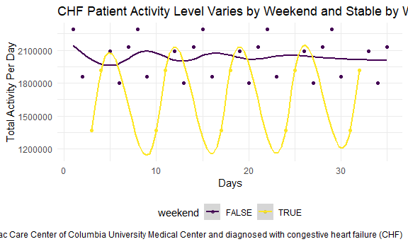

Homework 3
================
Jennifer Mizhquiri

    ## ── Attaching packages ─────────────────────────────────────── tidyverse 1.3.2 ──
    ## ✔ ggplot2 3.3.6      ✔ purrr   0.3.4 
    ## ✔ tibble  3.1.8      ✔ dplyr   1.0.10
    ## ✔ tidyr   1.2.0      ✔ stringr 1.4.1 
    ## ✔ readr   2.1.2      ✔ forcats 0.5.2 
    ## ── Conflicts ────────────────────────────────────────── tidyverse_conflicts() ──
    ## ✖ dplyr::filter() masks stats::filter()
    ## ✖ dplyr::lag()    masks stats::lag()

## Problem 1

Loaded instacart data

## Problem 2

*Office Hours* \* how can i make leverage \|\| , OR \* how to load a
promise object and view it…

    ## Rows: 35 Columns: 1443
    ## ── Column specification ────────────────────────────────────────────────────────
    ## Delimiter: ","
    ## chr    (1): day
    ## dbl (1442): week, day_id, activity.1, activity.2, activity.3, activity.4, ac...
    ## 
    ## ℹ Use `spec()` to retrieve the full column specification for this data.
    ## ℹ Specify the column types or set `show_col_types = FALSE` to quiet this message.

``` r
head(accel_df)
```

    ## # A tibble: 6 × 6
    ##    week day_id weekend day    min_24h activity_count
    ##   <dbl>  <dbl> <lgl>   <fct>    <dbl>          <dbl>
    ## 1     1      1 FALSE   Friday       1           88.4
    ## 2     1      1 FALSE   Friday       2           82.2
    ## 3     1      1 FALSE   Friday       3           64.4
    ## 4     1      1 FALSE   Friday       4           70.0
    ## 5     1      1 FALSE   Friday       5           75.0
    ## 6     1      1 FALSE   Friday       6           66.3

There are 50400 observations. The variables in this dataset contain
information on the sequential days (from days 1 to 35 and for each
minute within each day). The accelerometer tracks activity which it
quanitifies as activity counts. Based on the background information this
is accelerometer data for a given individual diagnosed with CHD.

*officehours* how to fix axis, coding, because weekend should be a
logical variable so i changed that but geom_path makes it look like
something taht is not continuous per se… what would be the best way to
mayube aartificially change the axis. using geom_path and weekend as a
continuous variable would have also been interesting

``` r
accel_df %>% 
  group_by(
    day) %>%
  mutate(
    total_activity_per_day = sum(activity_count, na.rm = TRUE)
  ) %>% 
  ggplot(
    aes(x = day_id, y = total_activity_per_day, color = weekend)) + geom_point() + geom_smooth() + 
  labs(
    x = "Days",
    y = "Total Activity Per Day",
    title = "CHF Patient Activity Level Varies by Weekend and Stable by Weekday",
    caption = "Data came from five weeks of accelerometer data collected on a 63 year-old male with BMI 25, who was admitted to the Advanced Cardiac Care Center of Columbia University Medical Center and diagnosed with congestive heart failure (CHF)"
  )
```

    ## `geom_smooth()` using method = 'gam' and formula 'y ~ s(x, bs = "cs")'


The primary trend that is apparent is that the CHF patient has a higher
overall activity level on weekdays relative to weekends. However, on
Saturdays, activity levels drop and on Sundays activity levels are
within range of weekday level activities, suggesting that Saturday is
relatively a sedentary anomaly.

weather_df %\>% ggplot(aes(x = tmin, y = tmax, color = name)) +
geom_point(alpha = .3) + geom_smooth(se = FALSE) + \#suppress error bars
facet_grid(name \~ .) \#(row \~ column .) where . is for not faceting by
anything leave blank

*Office hour* where i would put the na.rm true for this graph

``` r
accel_df %>% 
  group_by(day) %>% 
  ggplot(aes(x = day_id, y = activity_count, color = day)) + 
  geom_point(alpha = .3) + geom_smooth(se = FALSE)+
  labs(
    x = "Days",
    y = "Activity Counts",
    title = "CHF Patient Activity Level Over time")
```

    ## `geom_smooth()` using method = 'gam' and formula 'y ~ s(x, bs = "cs")'

    ## Warning: Computation failed in `stat_smooth()`:
    ## x has insufficient unique values to support 10 knots: reduce k.


The primary trend is that in some cases, particularly on Saturdays, it
looks like the accelerometer was not or was hardly worn. Other than
that, in reality, some Saturdays the patient did appear to be active.
Wednesdays and Fridays do appear to be mroe consistently active than
other times.
