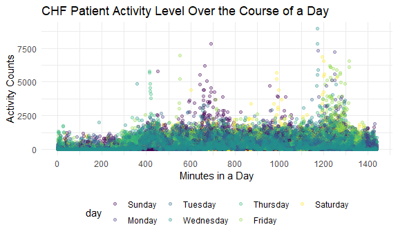
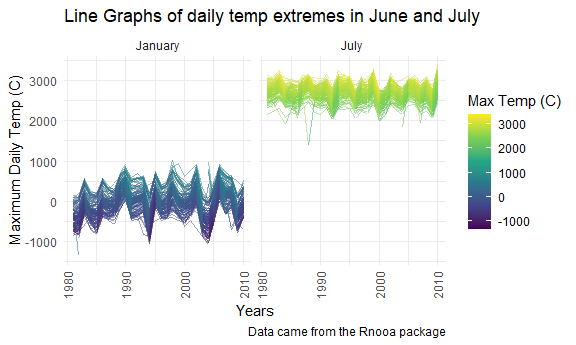
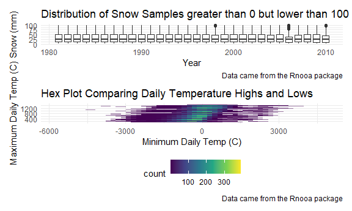

Homework 3
================
Jennifer Mizhquiri

    ## ── Attaching packages ─────────────────────────────────────── tidyverse 1.3.2 ──
    ## ✔ ggplot2 3.3.6      ✔ purrr   0.3.4 
    ## ✔ tibble  3.1.8      ✔ dplyr   1.0.10
    ## ✔ tidyr   1.2.0      ✔ stringr 1.4.1 
    ## ✔ readr   2.1.2      ✔ forcats 0.5.2 
    ## ── Conflicts ────────────────────────────────────────── tidyverse_conflicts() ──
    ## ✖ dplyr::filter() masks stats::filter()
    ## ✖ dplyr::lag()    masks stats::lag()

## Problem 1

## Problem 2

    ## Rows: 35 Columns: 1443
    ## ── Column specification ────────────────────────────────────────────────────────
    ## Delimiter: ","
    ## chr    (1): day
    ## dbl (1442): week, day_id, activity.1, activity.2, activity.3, activity.4, ac...
    ## 
    ## ℹ Use `spec()` to retrieve the full column specification for this data.
    ## ℹ Specify the column types or set `show_col_types = FALSE` to quiet this message.

``` r
head(accel_df)
```

    ## # A tibble: 6 × 6
    ##    week day_id weekend day    min_24h activity_count
    ##   <dbl>  <dbl> <lgl>   <fct>    <dbl>          <dbl>
    ## 1     1      1 FALSE   Friday       1           88.4
    ## 2     1      1 FALSE   Friday       2           82.2
    ## 3     1      1 FALSE   Friday       3           64.4
    ## 4     1      1 FALSE   Friday       4           70.0
    ## 5     1      1 FALSE   Friday       5           75.0
    ## 6     1      1 FALSE   Friday       6           66.3

The above is a snapshot of accelerometer data collected for a given
individual diagnosed with CHD.There are 50400 observations. The
variables in this dataset contain information on the sequential days
(from days 1 to 35 and for each minute within each day). The
accelerometer tracks activity which it quantifies as activity counts.

*officehours* how to fix axis, coding, because weekend should be a
logical variable so i changed that but geom_path makes it look like
something taht is not continuous per se… what would be the best way to
mayube aartificially change the axis. using geom_path and weekend as a
continuous variable would have also been interesting

``` r
accel_df %>% 
  group_by(
    day) %>%
  mutate(
    total_activity_per_day = sum(activity_count, na.rm = TRUE)
  ) %>% 
  ggplot(
    aes(x = day_id, y = total_activity_per_day, color = weekend)) + geom_point() + geom_smooth() + 
  labs(
    x = "Days",
    y = "Total Activity Per Day",
    title = "CHF Patient Activity Level Varies by Weekend and Stable by Weekday",
    caption = "Data came from five weeks of accelerometer data collected on a 63 year-old male with BMI 25, who was admitted to the Advanced Cardiac Care Center of Columbia University Medical Center and diagnosed with congestive heart failure (CHF)"
  )
```

``` r
accel_df %>% 
  group_by(day, week) %>%
  summarize(
    total_activity_per_day = sum(activity_count, na.rm = TRUE)
  ) %>% #observations
  knitr::kable(digits = 2)
```

    ## `summarise()` has grouped output by 'day'. You can override using the `.groups`
    ## argument.

| day       | week | total_activity_per_day |
|:----------|-----:|-----------------------:|
| Sunday    |    1 |              631105.00 |
| Sunday    |    2 |              422018.00 |
| Sunday    |    3 |              467052.00 |
| Sunday    |    4 |              260617.00 |
| Sunday    |    5 |              138421.00 |
| Monday    |    1 |               78828.07 |
| Monday    |    2 |              295431.00 |
| Monday    |    3 |              685910.00 |
| Monday    |    4 |              409450.00 |
| Monday    |    5 |              389080.00 |
| Tuesday   |    1 |              307094.24 |
| Tuesday   |    2 |              423245.00 |
| Tuesday   |    3 |              381507.00 |
| Tuesday   |    4 |              319568.00 |
| Tuesday   |    5 |              367824.00 |
| Wednesday |    1 |              340115.01 |
| Wednesday |    2 |              440962.00 |
| Wednesday |    3 |              468869.00 |
| Wednesday |    4 |              434460.00 |
| Wednesday |    5 |              445366.00 |
| Thursday  |    1 |              355923.64 |
| Thursday  |    2 |              474048.00 |
| Thursday  |    3 |              371230.00 |
| Thursday  |    4 |              340291.00 |
| Thursday  |    5 |              549658.00 |
| Friday    |    1 |              480542.62 |
| Friday    |    2 |              568839.00 |
| Friday    |    3 |              467420.00 |
| Friday    |    4 |              154049.00 |
| Friday    |    5 |              620860.00 |
| Saturday  |    1 |              376254.00 |
| Saturday  |    2 |              607175.00 |
| Saturday  |    3 |              382928.00 |
| Saturday  |    4 |                1440.00 |
| Saturday  |    5 |                1440.00 |

``` r
accel_df %>% 
  group_by(day, week) %>%
  summarize(
    total_activity_per_day = sum(activity_count, na.rm = TRUE)
  ) %>% 
  pivot_wider(
    names_from = "day", 
    values_from = "total_activity_per_day") %>% 
  knitr::kable(digits = 2)
```

    ## `summarise()` has grouped output by 'day'. You can override using the `.groups`
    ## argument.

| week | Sunday |    Monday |  Tuesday | Wednesday | Thursday |   Friday | Saturday |
|-----:|-------:|----------:|---------:|----------:|---------:|---------:|---------:|
|    1 | 631105 |  78828.07 | 307094.2 |    340115 | 355923.6 | 480542.6 |   376254 |
|    2 | 422018 | 295431.00 | 423245.0 |    440962 | 474048.0 | 568839.0 |   607175 |
|    3 | 467052 | 685910.00 | 381507.0 |    468869 | 371230.0 | 467420.0 |   382928 |
|    4 | 260617 | 409450.00 | 319568.0 |    434460 | 340291.0 | 154049.0 |     1440 |
|    5 | 138421 | 389080.00 | 367824.0 |    445366 | 549658.0 | 620860.0 |     1440 |

There are a few observable trends. As the weeks advanced, the patients
activity level tended to remain stable on Mondays - Thursdays. From a
given Friday to the next Friday (with one exception), activity levels
overall seemed to increase. From a given Saturday to the following
Saturday, it is possible that the patient may have neglected to wear the
accelerometer due to the markedly decreased number of steps in the last
two weeks relative to the precedeing three weeks. On Sundays, the
activity levels also appeared to decrease although the accelerometer
appeared to still be worn. Of course, given that the data collection is
dependent on participant adherence to wearing an accelerometer 24 hours
a day, this data is a best guess snapshot. To better inspect the
missings a different visual format would be helpful.

``` r
accel_df %>% 
  group_by(min_24h, day) %>% 
  ggplot(aes(x = min_24h, y = activity_count, color = day)) + 
  geom_point(alpha = .3) +
  labs(
    x = "Minutes in a Day",
    y = "Activity Counts",
    title = "CHF Patient Activity Level Over the Course of a Day") + 
  scale_x_continuous(
    breaks = c(0, 180, 360, 540, 720, 900, 1080, 1260, 1440), 
    labels = c("12AM", "3AM", "6AM", "9AM", "12PM", "3PM", "6PM","9PM", "12AM +D"),
    limits = c(0, 1440) 
    )
```



The patient’s activity level/score did not exceed 2500 per minute across
most days. The patient was more active after 6AM overall, and tended to
break the 2500 threshold particularly around or before 12PM, or around
4PM or around 9PM.These were more likely to occur on Sundays, Saturdays,
Wednesdays, and Fridays.

## Problem 3

``` r
ny_noaa %>% 
  mutate(
    tmax = as.numeric(tmax),
    tmin = as.numeric(tmin)) %>% 
  summary()
```

    ##       id                 date                 prcp               snow       
    ##  Length:2595176     Min.   :1981-01-01   Min.   :    0.00   Min.   :  -13   
    ##  Class :character   1st Qu.:1988-11-29   1st Qu.:    0.00   1st Qu.:    0   
    ##  Mode  :character   Median :1997-01-21   Median :    0.00   Median :    0   
    ##                     Mean   :1997-01-01   Mean   :   29.82   Mean   :    5   
    ##                     3rd Qu.:2005-09-01   3rd Qu.:   23.00   3rd Qu.:    0   
    ##                     Max.   :2010-12-31   Max.   :22860.00   Max.   :10160   
    ##                                          NA's   :145838     NA's   :381221  
    ##       snwd             tmax              tmin        
    ##  Min.   :   0.0   Min.   :-389.0    Min.   :-594.0   
    ##  1st Qu.:   0.0   1st Qu.:  50.0    1st Qu.: -39.0   
    ##  Median :   0.0   Median : 150.0    Median :  33.0   
    ##  Mean   :  37.3   Mean   : 139.8    Mean   :  30.3   
    ##  3rd Qu.:   0.0   3rd Qu.: 233.0    3rd Qu.: 111.0   
    ##  Max.   :9195.0   Max.   : 600.0    Max.   : 600.0   
    ##  NA's   :591786   NA's   :1134358   NA's   :1134420

There are 2595176 observations and 7 variables. Specifically, there is
weather data, such as the ID, the date, the precipitation, snow, snow
and wind, max temperature and minimum temperature.In terms of missing
data, snow depth (`snwd`) has the largest proportion of missing data
relative to snow, precipitation, tmax, and tmin. There are 591786
missing values for snwd, 381221 missing values for snow, 145838 missing
values for precipitation, 1134358 missing values for maximum
temperature, and 1134420 missing values for minimum temperature.

For snowfall, what are the most commonly observed values?

``` r
ny_noaa_tidy %>% 
  count(
    snow) %>% 
  arrange(desc(n)) 
```

    ## # A tibble: 282 × 2
    ##     snow       n
    ##    <dbl>   <int>
    ##  1     0 2008508
    ##  2    NA  381221
    ##  3   250   31022
    ##  4   130   23095
    ##  5   510   18274
    ##  6   760   10173
    ##  7    80    9962
    ##  8    50    9748
    ##  9   380    9197
    ## 10    30    8790
    ## # … with 272 more rows

``` r
ny_noaa_tidy %>% 
  group_by(snow) %>% 
  summarize(
     n_obs = n()) %>% 
  arrange(desc(n_obs))
```

    ## # A tibble: 282 × 2
    ##     snow   n_obs
    ##    <dbl>   <int>
    ##  1     0 2008508
    ##  2    NA  381221
    ##  3   250   31022
    ##  4   130   23095
    ##  5   510   18274
    ##  6   760   10173
    ##  7    80    9962
    ##  8    50    9748
    ##  9   380    9197
    ## 10    30    8790
    ## # … with 272 more rows

-   The most commonly observed value of snow is 0cm (also: 0 mm)

Make a two-panel plot showing the average max temperature in January and
in July in each station across years. Is there any observable /
interpretable structure? Any outliers?

``` r
ny_noaa_tidy %>%
    filter(
    month %in% c("January","July")) %>% 
  group_by(month, year, id) %>% 
  summarize(
    tmax_mean = mean(tmax, na.rm = TRUE)
  ) %>% 
  ggplot(aes(x = year, y = tmax_mean, group = id, color = tmax_mean)) +
  scale_x_continuous(
    breaks = c(1980, 1990, 2000, 2010),
    labels = c("1980", "1990", "2000", "2010")) +
  geom_line(alpha = 0.5) +
  labs(
    x = "Years",
    y = "Maximum Daily Temp (C)",
    title = "Line Graphs of daily temp extremes in June and July",
    caption = "Data came from the Rnooa package",
    color = "Max Temp (C)"
    ) +
  theme(axis.text.x = element_text(angle = 90, vjust = 0.5, hjust = 1)) + 
  theme(legend.position = "right") + 
  facet_grid(. ~ month) 
```

    ## `summarise()` has grouped output by 'month', 'year'. You can override using the
    ## `.groups` argument.

    ## Warning: Removed 5640 row(s) containing missing values (geom_path).



*Trends observed* In general, m

Make a two-panel plot showing (i) tmax vs tmin for the full dataset
(note that a scatterplot may not be the best option); *office hours*
what is group = doing how do i differentiate the different Ids

and (ii) make a plot showing the distribution of snowfall values greater
than 0 and less than 100 separately by year

``` r
snow_plot / temp_noaa_plot 
```


