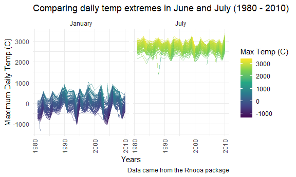

Homework 3
================
Jennifer Mizhquiri

## Problem 1

## Problem 2

``` r
head(accel_df)
```

    ## # A tibble: 6 × 6
    ##    week day_id weekend day    min_24h activity_count
    ##   <dbl>  <dbl> <lgl>   <fct>    <dbl>          <dbl>
    ## 1     1      1 FALSE   Friday       1           88.4
    ## 2     1      1 FALSE   Friday       2           82.2
    ## 3     1      1 FALSE   Friday       3           64.4
    ## 4     1      1 FALSE   Friday       4           70.0
    ## 5     1      1 FALSE   Friday       5           75.0
    ## 6     1      1 FALSE   Friday       6           66.3

*About the dataset* The above is a snapshot of accelerometer data
collected for a given individual diagnosed with CHD.There are 50400
observations. The variables in this dataset contain information on the
sequential days (from days 1 to 35 and for each minute within each day),
as well as the day of the week. The accelerometer tracks activity which
it quantifies as activity counts.

*Trends from aggregating total activity over the day*

    ## `summarise()` has grouped output by 'day'. You can override using the `.groups`
    ## argument.

| week | Sunday |    Monday |  Tuesday | Wednesday | Thursday |   Friday | Saturday |
|-----:|-------:|----------:|---------:|----------:|---------:|---------:|---------:|
|    1 | 631105 |  78828.07 | 307094.2 |    340115 | 355923.6 | 480542.6 |   376254 |
|    2 | 422018 | 295431.00 | 423245.0 |    440962 | 474048.0 | 568839.0 |   607175 |
|    3 | 467052 | 685910.00 | 381507.0 |    468869 | 371230.0 | 467420.0 |   382928 |
|    4 | 260617 | 409450.00 | 319568.0 |    434460 | 340291.0 | 154049.0 |     1440 |
|    5 | 138421 | 389080.00 | 367824.0 |    445366 | 549658.0 | 620860.0 |     1440 |

There are a few observable trends. As the weeks advanced, the patients
activity level tended to remain stable on Mondays - Thursdays. From a
given Friday to the next Friday (with one exception), activity levels
overall seemed to increase. From a given Saturday to the following
Saturday, it is possible that the patient may have neglected to wear the
accelerometer due to the markedly decreased number of steps in the last
two weeks relative to the precedeing three weeks. On Sundays, the
activity levels also appeared to decrease although the accelerometer
appeared to still be worn. Of course, given that the data collection is
dependent on participant adherence to wearing an accelerometer 24 hours
a day, this data is a best guess snapshot. To better inspect the
missings a different visual format would be helpful.

*24-hour activity time courses for a given day of the week*


Of note, the data was originally collected in minutes per day but were
relabeled with time corresponding to 24-hr time period for the reader’s
ease. The patient’s activity level/score did not exceed 2500 per minute
across most days. The patient was more active after 6AM overall, and
tended to break the 2500 threshold particularly around or around 12PM;
4PM; 9PM. These were more likely to occur on Sundays, Saturdays,
Wednesdays, and Fridays.

## Problem 3

*Step 1: Explore the Data*

``` r
ny_noaa %>% 
  mutate(
    tmax = as.numeric(tmax),
    tmin = as.numeric(tmin)) %>% 
  summary()
```

There are 2595176 observations and 7 variables. Specifically, there is
weather data, such as the ID, the date, the precipitation (`prcp`), snow
(`snow`), snow depth (`snwd`), max temperature (`tmax`) and minimum
temperature (`tmin`).In terms of missing data, snow depth has the
largest proportion of missing data relative to snow, precipitation,
tmax, and tmin. There are 591786 missing values for snwd, 381221 missing
values for snow, 145838 missing values for precipitation, 1134358
missing values for maximum temperature, and 1134420 missing values for
minimum temperature. Of note the original units for precipitation is in
tenths of mm, snowfall and snow depth are in millimeters, and
temeprature is in tenths of degrees Celsius (C). These units will be
changed in the following step.

*Step 2: Clean the Data*

-   Snow, Snow depth, and precipitation is changed to cm
-   Temperature is changed to degrees C

<!-- -->

    ## # A tibble: 6 × 9
    ##   id           year month      day  prcp  snow  snwd  tmax  tmin
    ##   <chr>       <int> <fct>    <int> <dbl> <dbl> <dbl> <dbl> <dbl>
    ## 1 US1NYAB0001  2007 November     1    NA    NA    NA    NA    NA
    ## 2 US1NYAB0001  2007 November     2    NA    NA    NA    NA    NA
    ## 3 US1NYAB0001  2007 November     3    NA    NA    NA    NA    NA
    ## 4 US1NYAB0001  2007 November     4    NA    NA    NA    NA    NA
    ## 5 US1NYAB0001  2007 November     5    NA    NA    NA    NA    NA
    ## 6 US1NYAB0001  2007 November     6    NA    NA    NA    NA    NA

*Step 3: For snowfall, what are the most commonly observed values?* \`

``` r
ny_noaa_tidy %>% 
  group_by(snow) %>% 
  summarize(
     n_obs = n()) %>% 
  arrange(desc(n_obs))
```

-   The most commonly observed value of snow is 0cm (also: 0 mm in the
    original units)

*Step 4: Make a two-panel plot showing the average max temperature in
January and in July in each station across years.*



-   Overall, on average each station could be said to be in lower
    temperatures (as measured in Celsius) in January and have higher on
    average temperatures in July. Broadly, there is a range in January
    that may be observed varying from -1000 C to 1000 C and a range of
    2000 C to 3000 C in July. These trends and ranges are apparently
    consistent from 1980 to 2020. There are some outliers in January
    (i.e. circa 1980 and 2000) but they are not as extreme. In July
    however, the outliers are more dramatic, particularly sometime in
    the late 1980s.

*Step 5: Make a two-panel plot showing (i) tmax vs tmin for the full
dataset and (ii) make a plot showing the distribution of snowfall values
greater than 0 and less than 100 separately by year*


